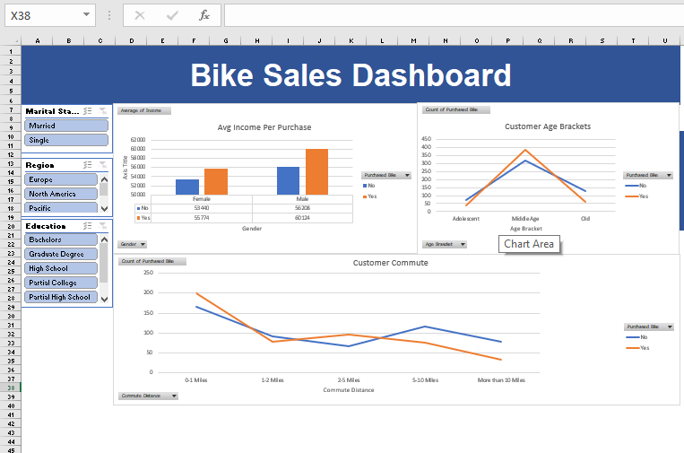

# Analysis-with-excel

## Bike Sales Analysis

### Description
The Bike Sales Analysis project provides insights into customer purchasing behavior, highlighting trends based on income, age, and commute distance. This dashboard offers detailed demographic analysis with filters for marital status, region, and education, enabling a deeper understanding of bike sales data.

### Overview
Our new bike sales dashboard provides key insights into customer purchasing behavior, highlighting trends based on income, age, and commute distance. This tool offers detailed demographic analysis with filters for marital status, region, and education, enabling a deeper understanding of our bike sales data.

### Dashboard

#### Key Features:
- **Avg Income Per Purchase**: Compares average income for bike buyers and non-buyers across different regions.
- **Customer Age Brackets**: Shows the distribution of bike buyers and non-buyers across different age groups.
- **Customer Commute**: Analyzes the commuting distances of bike buyers and non-buyers.

